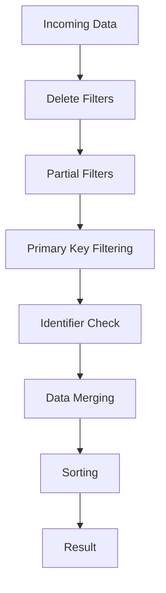

# SPINE Update System Architecture Guide

This document provides architectural context and practical guidance for the SPINE protocol update system implemented in `update.go`. For detailed API documentation, see the godoc comments in the source code.

## Overview

The SPINE update system is a sophisticated data management layer that handles partial updates, filtering, and anti-duplication measures critical for maintaining data consistency in multi-device smart home networks.

## SPINE Protocol Background

### What is SPINE?

SPINE (Smart Premises Interoperable Neutral-message Exchange) is a protocol for device communication in smart home and energy management systems. It enables interoperable communication between devices from different manufacturers.

### Why Complex Update Semantics?

SPINE devices operate in challenging environments:
- **Partial Data**: Devices often send incomplete information
- **Network Issues**: Messages may be lost or arrive out of order  
- **Multi-Vendor**: Different implementations may behave differently
- **Real-Time**: Updates must be processed quickly and reliably

## Key Architectural Concepts

### 1. EEBus Tag System

Data structures use reflection-based tags to define field behavior:

```go
type MeasurementData struct {
    MeasurementId *uint   `eebus:"key,primarykey"`  // Primary identifier
    ValueType     *string `eebus:"key"`             // Sub-identifier
    Value         *int                              // Data field
    Writable      *bool   `eebus:"writecheck"`      // Permission control
}
```

**Tag Types:**
- `key`: Identifies fields used for uniqueness
- `primarykey`: Primary identifier in composite keys (prevents duplicates)
- `writecheck`: Controls remote write permissions

### 2. Anti-Duplication Strategy

The system prevents duplicate entries using a multi-layered approach:

1. **Primary Key Detection**: Identifies entries with only key fields
2. **Filtering**: Removes key-only entries before merging
3. **Logging**: Provides visibility into filtered data

**Example Scenario:**
```go
// Remote device sends structure first:
{MeasurementId: 1} // Filtered out (key-only)

// Then sends data:
{MeasurementId: 1, ValueType: "power", Value: 100} // Processed
```

### 3. Update Flow Pipeline



Each stage serves a specific purpose:
- **Delete**: Remove unwanted entries/fields
- **Partial**: Update specific fields only
- **Key Filtering**: Prevent duplicates
- **Identifier Check**: Handle incomplete keys
- **Merging**: Combine new with existing data
- **Sorting**: Ensure consistent ordering

## Migration Guide: Primary Key Tags

### Background

The primary key tag system was introduced to solve duplicate entry problems in composite key scenarios. Before this system, any entry with key fields would be processed, leading to duplicate entries when remote devices sent incomplete data.

### Migration Steps

1. **Identify Composite Key Types**: Look for structs with multiple `eebus:"key"` fields
2. **Add Primary Key Tags**: Tag the main identifier with `eebus:"key,primarykey"`
3. **Test Filtering**: Verify that key-only entries are properly filtered
4. **Update Tests**: Ensure test cases cover the new behavior

**Example Migration:**
```go
// Before:
type LoadControlLimit struct {
    LimitId   *uint   `eebus:"key"`
    Category  *string `eebus:"key"` 
    Value     *int
}

// After:
type LoadControlLimit struct {
    LimitId   *uint   `eebus:"key,primarykey"`  // Main identifier
    Category  *string `eebus:"key"`             // Sub-identifier
    Value     *int
}
```

### Backward Compatibility

The system maintains compatibility:
- Single key types work without primarykey tags
- Legacy structs continue to function
- Gradual migration is supported

## Practical Usage Patterns

### 1. Basic List Updates

```go
existing := []MeasurementData{
    {MeasurementId: util.Ptr(1), ValueType: util.Ptr("power"), Value: util.Ptr(100)},
}

new := []MeasurementData{
    {MeasurementId: util.Ptr(1), Value: util.Ptr(150)}, // Update existing
    {MeasurementId: util.Ptr(2), ValueType: util.Ptr("voltage"), Value: util.Ptr(220)}, // Add new
}

result, success := UpdateList(false, existing, new, nil, nil)
// Result: Entry 1 updated to Value=150, Entry 2 added
```

### 2. Filtered Updates

```go
// Only update entries where MeasurementId = 1
filter := &FilterType{...} // Configure filter for MeasurementId = 1
result, success := UpdateList(false, existing, new, filter, nil)
```

### 3. Remote Write Permissions

```go
// Data from remote device - check write permissions
result, success := UpdateList(true, existing, new, nil, nil)
// Returns false if write permissions denied
```

## Troubleshooting

### Common Issues

1. **Duplicate Entries**
   - **Cause**: Missing primarykey tags in composite key structures
   - **Solution**: Add `primarykey` tags to main identifier fields

2. **Data Not Updating**
   - **Cause**: Write permissions denied for remote updates
   - **Solution**: Check `writecheck` tagged fields

3. **Entries Disappearing**
   - **Cause**: Primary key filtering removing valid data
   - **Solution**: Ensure entries contain non-key data

4. **Performance Issues**
   - **Cause**: Large datasets with complex key structures
   - **Solution**: Consider batch processing or pagination

### Debugging Tips

1. **Enable Debug Logging**: Set logging level to debug to see filtered entries
2. **Check Tag Configuration**: Verify EEBus tags are correctly applied
3. **Test Key Detection**: Use `hasPrimaryKeyOnly()` to test specific entries
4. **Validate Identifiers**: Use `HasIdentifiers()` to check key completeness

## Performance Considerations

### Optimization Strategies

1. **Minimize Reflection**: Cache field information when possible
2. **Batch Operations**: Process multiple updates together
3. **Filter Early**: Apply filters before expensive merge operations
4. **Index Key Fields**: For large datasets, consider indexing

### Memory Usage

- **Filtering**: Creates new slices only when entries are filtered
- **Merging**: Modifies existing slices in place when possible
- **Sorting**: Uses standard library's efficient sort implementation

## Security Considerations

### Write Permission Model

The system enforces a two-tier permission model:
1. **Local Operations**: Always allowed (trusted)
2. **Remote Operations**: Gated by `writecheck` fields

### Data Validation

- **Type Safety**: Uses Go's type system for compile-time validation
- **Nil Checking**: Safely handles nil pointers throughout
- **Boundary Checking**: Validates slice access and field existence

## Future Enhancements

### Planned Improvements

1. **Performance Optimization**: Caching of reflection metadata
2. **Enhanced Filtering**: More sophisticated filter expressions
3. **Validation Framework**: Integration with schema validation
4. **Metrics**: Performance and usage monitoring

### Extension Points

The system is designed for extensibility:
- **Custom Updaters**: Implement the `Updater` interface
- **Custom Tags**: Add new EEBus tag types
- **Custom Filters**: Extend filter processing logic

## References

- **SPINE Specification**: EEBus_SPINE_TS_ProtocolSpecification.pdf
- **Go Reflection**: https://pkg.go.dev/reflect
- **EEBus Tags**: See `eebus_tags.go` for tag definitions
- **Complete Examples**: See `example_update_test.go` for runnable examples
- **Test Coverage**: See `update_test.go`, `update_primary_key_filter_test.go`
- **Primary Key Guidelines**: See `PRIMARYKEY_TAG_GUIDELINES.md`

---

## Complete Working Examples

The `example_update_test.go` file contains comprehensive, runnable examples demonstrating:

1. **Duplicate Prevention** - How primary key filtering prevents duplicate entries
2. **Composite Key Handling** - Working with multi-field identifiers  
3. **Remote Write Permissions** - Using writecheck fields for access control
4. **Filter Usage** - Partial updates and selective deletions
5. **Broadcast Updates** - Updating all entries when identifiers are missing
6. **Error Handling** - Proper patterns for handling update failures
7. **Custom Updater** - Implementing the Updater interface

### Running the Examples

```bash
# Run all examples
go test -run Example ./model

# Run specific example  
go test -run Example_updateList_measurementDataDuplicatePrevention ./model
```

### API Documentation

For detailed API documentation, run:
```bash
godoc -http=:6060
# Navigate to localhost:6060/pkg/github.com/enbility/spine-go/model/
```